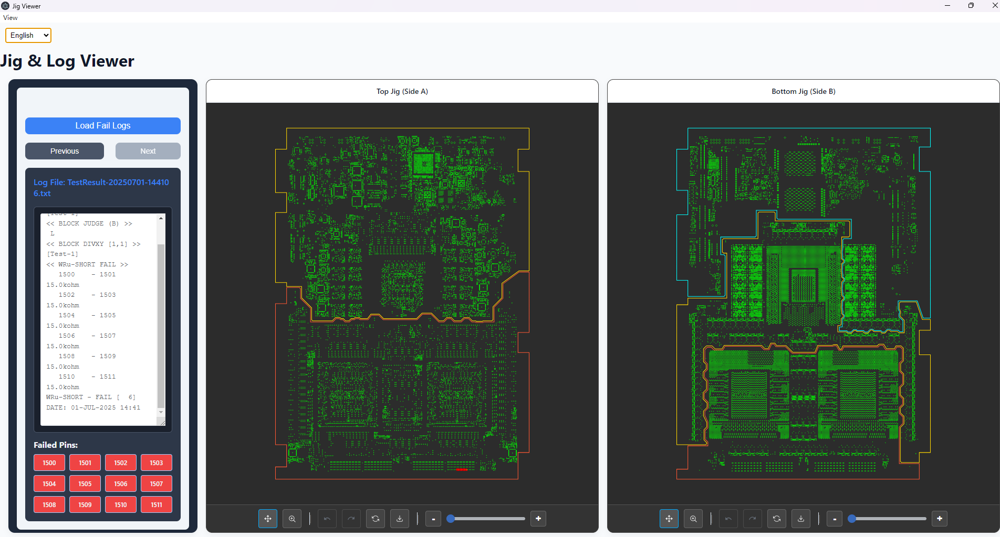
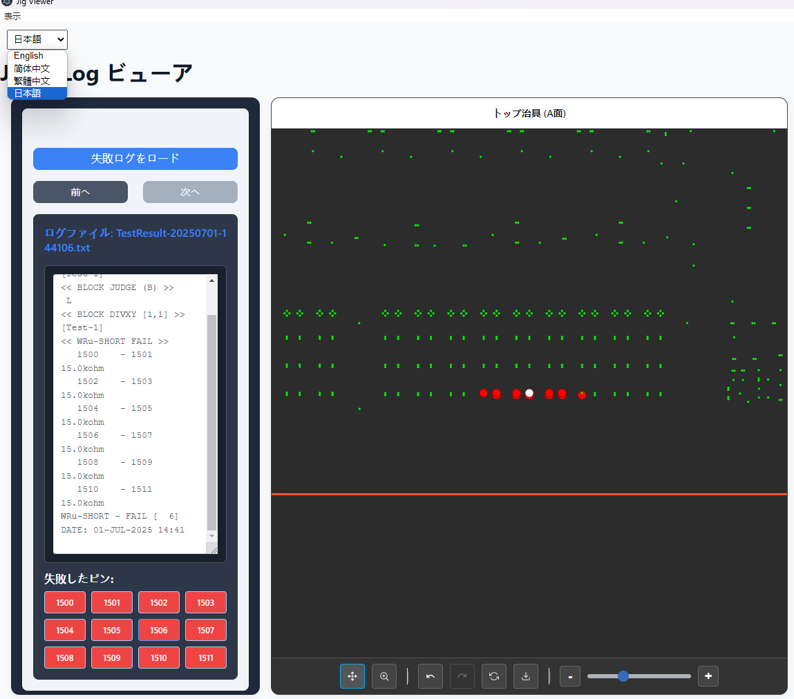
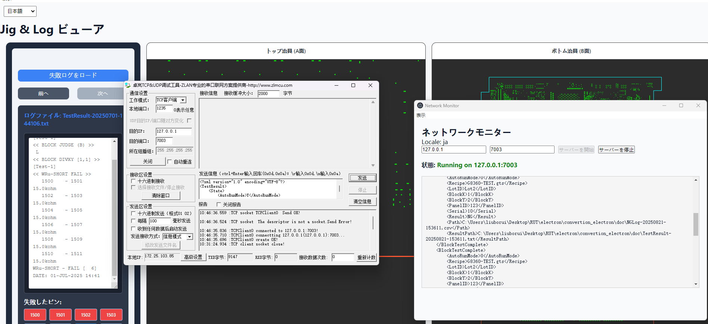
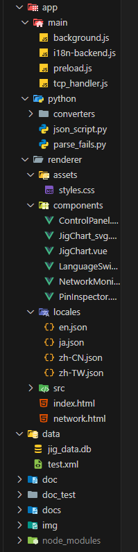

# Jig Viewer - 治具数据可视化工具

<p align="center">
  
  
  
  
</p>

## 项目概述

Jig Viewer 是一个专为电子制造业设计的高性能桌面应用程序，用于可视化和分析治具（JIG）和针点（ADR）数据。本应用采用 Electron 和 Vue.js 构建，提供接近专业 CAD 软件的交互体验，同时保持轻量级和高响应性。


## 核心功能

### 1. 数据可视化
- **双图表分离显示**：自动根据文件名（TOP/BOT）将数据分离到两个独立图表
- **高精度渲染**：精确绘制治具轮廓和针点位置
- **黑色背景**：专业的暗色主题，减轻视觉疲劳

### 2. 高级交互工具
- **模式切换**：独立的平移（Pan）和缩放（Zoom）模式
- **框选缩放**：通过拖拽选框实现精确区域放大
- **历史记录**：支持撤销（Undo）和重做（Redo）操作
- **多维度缩放**：按钮缩放、滑块控制和一键重置

### 3. 错误分析工具
- **自动错误标注**：读取CSV文件，自动标记错误针点
- **交互式检查**：点击错误点自动放大居中，并变色提供视觉反馈
- **数据库集成**：存储和管理历史错误数据
- **错误日志浏览**：支持浏览多个错误日志文件，并在界面上显示错误针点列表
- **错误类型识别**：解析并显示不同类型的错误，便于快速定位问题原因

### 4. 网络监控
- **TCP通信**：与GATS系统实时通信
- **独立监视器**：专用窗口实时显示通信日志
- **XML数据处理**：自动解析接收到的XML测试结果数据
- **文件自动复制**：根据XML中的路径信息自动复制相关测试文件
- **状态可视化**：直观显示服务器运行状态和连接情况

### 5. 国际化支持
- **多语言界面**：支持中文、英文、日文和繁体中文
- **动态切换**：运行时无缝切换语言
- **前后端同步**：语言设置在前端和Electron主进程间同步
- **组件化实现**：独立的LanguageSwitcher组件，便于在任何界面添加语言切换功能

### 6. 导出功能
- **SVG导出**：一键导出当前视图为SVG矢量图
- **保留黑色背景**：导出的SVG保持与应用内相同的视觉风格

## 技术栈

- **桌面框架**: Electron 28.0.0
- **前端框架**: Vue.js 3.4.0 (Composition API)
- **构建工具**: Vite 7.1.2
- **可视化**: SVG (自定义实现)
- **国际化**: vue-i18n 12.0.0
- **数据存储**: SQLite3 5.1.7
- **UI组件**: Element Plus 2.11.1
- **网络通信**: Node.js net模块
- **XML解析**: xml2js
- **Python集成**: 子进程调用与JSON通信

## 项目架构

本项目采用前后端分离架构，通过 Electron 作为桥梁连接：
### 1. Python 计算后端
- **核心文件**: 
  - `app/python/json_script.py`: 处理JIG数据计算
  - `app/python/parse_fails.py`: 解析错误日志文件
  - `app/python/converters/`: 数据转换脚本目录
- **职责**: 处理所有数据计算，包括坐标变换、交点计算和偏移量应用
- **输出**: 计算结果以JSON格式输出

### 2. Electron + Vue 前端
- **核心文件**: 
  - `app/main/background.js`: 主进程，负责协调通信
  - `app/main/preload.js`: 定义渲染进程与主进程的通信接口
  - `app/renderer/src/App.vue`: 应用主界面
  - `app/renderer/components/JigChart_svg.vue`: SVG图表组件，负责JIG数据的可视化展示
  - `app/renderer/components/JigChart.vue`: 基础图表组件，提供图表基础功能
  - `app/renderer/components/PinInspector.vue`: 错误针点检查组件，用于分析和显示错误针点
  - `app/renderer/components/NetworkMonitor.vue`: 网络监控组件，用于TCP服务器状态监控
  - `app/renderer/components/LanguageSwitcher.vue`: 语言切换组件，提供多语言支持
  - `app/renderer/components/ControlPanel.vue`: 控制面板组件，提供图表操作控制
- **职责**: 用户交互和数据可视化

### 3. 网络通信模块
- **核心文件**: `app/main/tcp_handler.js`
- **职责**: 处理TCP服务器创建、客户端连接管理、XML数据解析和文件复制
- **输出**: 实时通信状态和数据更新

### 4. 通信流程
1. 用户通过界面选择文件
2. Electron主进程调用Python脚本处理数据
3. 处理结果返回给渲染进程
4. Vue组件渲染可视化图表

## 项目结构

```
/
├── app/                    # 应用程序源代码
│   ├── main/               # Electron主进程代码
│   │   ├── background.js   # 主进程入口文件
│   │   ├── preload.js      # 预加载脚本
│   │   ├── tcp_handler.js  # TCP服务器处理模块
│   │   └── i18n-backend.js # 国际化后端模块
│   ├── renderer/           # 渲染进程代码
│   │   ├── src/            # 源代码
│   │   │   ├── main.js     # 渲染进程入口文件
│   │   │   ├── App.vue     # 主应用组件
│   │   │   ├── network.js  # 网络功能模块
│   │   │   └── i18n.js     # 国际化配置
│   │   ├── components/     # Vue组件
│   │   │   ├── ControlPanel.vue    # 控制面板组件
│   │   │   ├── JigChart.vue        # JIG图表组件
│   │   │   ├── JigChart_svg.vue    # SVG图表组件
│   │   │   ├── LanguageSwitcher.vue # 语言切换组件
│   │   │   ├── NetworkMonitor.vue  # 网络监控组件
│   │   │   └── PinInspector.vue    # 错误针点检查组件
│   │   ├── assets/         # 静态资源
│   │   ├── locales/        # 语言文件
│   │   ├── index.html      # 主窗口HTML
│   │   └── network.html    # 网络设置窗口HTML
│   └── python/             # Python脚本
│       ├── parse_fails.py  # 错误日志解析脚本
│       ├── json_script.py  # JSON处理脚本
│       └── converters/     # 数据转换脚本
├── data/                   # 应用数据
│   ├── jig_data.db         # SQLite数据库
│   └── test.xml            # 测试数据
├── docs/                   # 文档
│   ├── api/                # API文档
│   ├── user-guide/         # 用户指南
│   └── dev-guide/          # 开发指南
├── test/                   # 测试
│   ├── fixtures/           # 测试数据
│   │   ├── rut/            # RUT测试文件
│   │   ├── logs/           # 日志文件
│   │   └── results/        # 测试结果
│   └── unit/               # 单元测试
└── resources/              # 资源文件
    └── img/                # 图片资源
```

## 文档

- [API文档](docs/api/README.md) - 详细的API接口说明
- [用户指南](docs/user-guide/README.md) - 用户使用手册
- [开发指南](docs/dev-guide/README.md) - 开发者指南
5. 网络模块接收外部系统数据并处理

## 安装与运行

### 环境要求
- Node.js (v16+)
- Python 3.x
- npm 或 yarn

### 安装步骤

```bash
# 克隆仓库
git clone https://github.com/meti-liu/Convertion_Electron.git
cd Convertion_Electron

# 安装依赖
npm install

# 运行开发环境
npm run dev
```

## 使用指南

### 基本操作
1. 启动应用后，点击「Load & Process Files」按钮
2. 在弹出的对话框中选择相关的 .rut 和 .adr 文件
3. 使用工具栏进行交互：
   - 切换平移/缩放模式
   - 使用框选放大特定区域
   - 通过滑块调整缩放级别
   - 使用撤销/重做按钮浏览历史状态
   - 点击导出按钮保存SVG图像
4. 点击错误点可自动放大并居中显示

### 错误分析
1. 点击「Load Fail Logs」按钮加载错误日志
2. 在界面右侧查看错误日志内容和失败针点列表
3. 点击特定针点ID可在图表中高亮显示对应位置
4. 使用「Previous Log」和「Next Log」按钮浏览多个错误日志

### 网络监控
1. 打开网络监控窗口
2. 设置主机IP和端口号
3. 点击「Start Server」启动TCP服务器
4. 实时查看连接状态和接收到的数据
5. 服务器会自动处理接收到的XML测试结果并复制相关文件

### 语言切换
1. 通过界面右上角的语言选择器切换界面语言
2. 支持英文、简体中文、繁体中文和日文
3. 语言设置会在前后端同步，影响所有界面元素和对话框

## 开发历程

### 1.0.0 (初始版本)
- 基本框架搭建
- 实现文件加载和数据处理
- 基础图表渲染

### 2.0.0 (交互优化)
- 从Chart.js迁移到自定义SVG实现
- 添加平移和缩放功能
- 实现撤销/重做历史记录

### 3.0.0 (功能扩展)
- 添加错误点高亮和数据绑定
- 实现点击交互和视觉反馈
- 集成SQLite数据库
- 开发PinInspector组件，实现错误日志解析和显示
- 添加Python错误日志解析脚本

### 4.0.0 (网络与国际化)
- 实现TCP通信功能
- 添加网络监视器窗口
- 开发XML数据处理和文件自动复制功能
- 集成vue-i18n实现多语言支持
- 创建LanguageSwitcher组件
- 实现前后端语言设置同步
- 解决窗口同步问题

### 5.0.0 (当前版本)
- 添加SVG导出功能
- 优化黑色背景显示
- 完善国际化支持
- 重构组件结构，提高代码复用性
- 优化TCP服务器稳定性和错误处理
- 提升整体性能和稳定性

## 技术实现细节

### 组件通信机制

本项目采用多种通信机制确保各部分协同工作：

1. **Electron IPC通信**
   - 通过`preload.js`定义的`electronAPI`接口实现渲染进程与主进程通信
   - 使用`ipcRenderer.invoke`进行双向通信，`ipcRenderer.send`进行单向通信
   - 使用`ipcRenderer.on`注册事件监听器接收主进程消息

2. **Vue组件间通信**
   - 使用Props向下传递数据（如从App到JigChart_svg）
   - 使用自定义事件向上传递数据（如PinInspector的`highlight-pins`事件）
   - 使用Vue的响应式系统在组件间共享状态

3. **Python与JavaScript通信**
   - 通过子进程调用Python脚本
   - 使用标准输出（stdout）传递JSON格式的计算结果
   - 使用标准错误（stderr）传递错误信息

4. **TCP网络通信**
   - 使用Node.js的`net`模块创建TCP服务器
   - 实现XML数据的流式解析和处理
   - 通过IPC将网络事件传递给渲染进程

### 关键技术实现

1. **SVG图表渲染**
   - 自定义SVG元素创建和操作
   - 实现平移、缩放、框选等交互功能
   - 使用变换矩阵（transform）实现视图变换
   - 维护操作历史栈实现撤销/重做功能

2. **错误分析系统**
   - Python脚本解析CSV错误日志
   - 提取针点ID和错误类型信息
   - 在Vue组件中高亮显示错误针点
   - 实现点击交互和视觉反馈

3. **国际化实现**
   - 使用vue-i18n管理翻译资源
   - 实现动态语言切换
   - 前后端语言设置同步
   - 支持组件级别的翻译

4. **性能优化**
   - 使用SVG代替Canvas提高渲染性能
   - 实现虚拟滚动减少DOM元素数量
   - 使用防抖和节流优化频繁操作
   - 异步加载和处理大型数据文件

## 贡献指南

欢迎提交问题报告和功能请求。如需贡献代码，请遵循以下步骤：

1. Fork 本仓库
2. 创建您的特性分支 (`git checkout -b feature/amazing-feature`)
3. 提交您的更改 (`git commit -m 'Add some amazing feature'`)
4. 推送到分支 (`git push origin feature/amazing-feature`)
5. 打开一个 Pull Request

## 许可证

本项目采用 ISC 许可证 - 详情请参阅 [LICENSE](LICENSE) 文件

## 联系方式

项目维护者: [meti-liu](https://github.com/meti-liu)